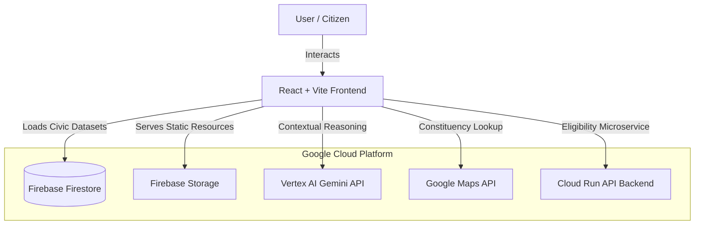

# India Election Companion Assistant

An advanced, AI-powered digital companion designed to bridge the electoral literacy gap in India. This platform serves as a "First-Time Indian Voter Companion," guiding citizens through every phase of the democratic process—from registration to casting their vote.

## 🎯 Challenge Vertical: First-Time Indian Voter Companion Assistant

### Problem Statement
First-time voters in India often face significant hurdles:
- **Complexity**: Confusion regarding Form 6 registration and specific document requirements.
- **Process Anxiety**: Uncertainty about the step-by-step procedure inside a polling booth.
- **Misinformation**: Exposure to myths regarding EVMs, VVPATs, and voting rights.
- **Data Fragmentation**: Difficulty in locating specific constituency and booth details.

### Solution Overview
The **India Election Companion Assistant** addresses these challenges through a centralized, AI-driven experience:
- **AI-Powered Guidance**: A specialized Gemini-based assistant for context-aware civic Q&A.
- **Readiness Scoring**: A dynamic logic engine that evaluates a voter's preparedness based on registration and awareness.
- **Immersive Simulation**: A 3D-styled voting simulator to demystify the booth experience.
- **Constituency Intelligence**: Real-time booth and administrative lookup using PINCODE.
- **Fact-Check Engine**: Proactive detection and clarification of electoral myths.
- **Multilingual Support**: Seamless transitions between English, Hindi, and Telugu.

---

## 🛠 Google Services & Technologies Used

### Core Google Infrastructure
- **Vertex AI Gemini**: Powers the "Electoral Knowledge Engine" for structured, civic-minded responses.
- **Firebase Firestore**: Manages real-time data for timelines, myths, quiz topics, and user progress.
- **Firebase Storage**: Securely handles educational document storage and user profile assets.
- **Google Maps API**: Facilitates polling station visualization and distance calculation.
- **Cloud Run**: Hosts the project's backend API and static frontend assets for scalable performance.
- **Antigravity IDE**: Used for advanced agentic coding and project orchestration.

### Architecture
- **Frontend**: React 19 + Vite + TailwindCSS (Vanilla CSS for premium styling).
- **Backend**: Node.js + Express (running on Cloud Run).
- **Animation**: Motion (framer-motion) for fluid transitions.
- **Icons**: Lucide React.

---

## 🌟 Key Features

1.  **Chat Assistant**: Grounded AI assistant for first-time voters with step-by-step guidance.
2.  **Voting Readiness Analyzer**: Dashboard widget calculating readiness based on docs and registration status.
3.  **Timeline Learning Journey**: Interactive roadmap of the election cycle (Notification to Results).
4.  **Document Center**: Verification guide for required age and residence proofs.
5.  **Myth vs Fact Detector**: A curated interface to clarify electoral misinformation.
6.  **Quiz Engine**: Gamified learning modules with topics on constitutional rights.
7.  **Voting Simulation**: Digital walkthrough of the polling booth (Inking → EVM → VVPAT).
8.  **Constituency Lookup**: Instant identification of Parliamentary and Assembly constituencies.
9.  **Interactive Dashboard**: Centralized hub for tracking voter readiness and news.

---

---

---

## 🏗️ System Architecture

The India Election Companion Assistant follows a cloud-native, microservices-oriented architecture designed for reliability and scale.



### ASCII Architecture Flow:
```text
[ User / Citizen ]
       │
       ▼
[ React + Vite Frontend ] ──────────┐
       │                            │
       ├─ (1) Load Civic Datasets ─▶[ Firestore ]
       │                            │
       ├─ (2) Contextual Reasoning ─▶[ Vertex AI Gemini ]
       │                            │
       ├─ (3) Eligibility Service ──▶[ Cloud Run API ]
       │                            │
       ├─ (4) Static Resource Host ─▶[ Firebase Storage ]
       │                            │
       └─ (5) Constituency Lookup ──▶[ Google Maps API ]
```

---

## 🧠 Assistant Decision Logic Engine

The **India Election Companion** is an intelligent advisor that dynamically computes a voter's readiness based on their unique journey.

### 1. Readiness Scoring Algorithm
The engine determines the "Voter Readiness Score" by evaluating the following logic branches:
- **Age Eligibility**: Checks if the user meets the 18+ requirement as of January 1st.
- **Registration Awareness**: Validates completion of the Form 6 registration simulation.
- **Document Readiness**: Tracks the availability of mandatory Proof of Identity and Address.
- **Polling Knowledge**: Measures awareness of EVM/VVPAT operations.
- **Timeline Completion**: Tracks if the user has reviewed the critical milestones in the electoral cycle.

### 2. Adaptive Intelligence
The Gemini assistant adapts its recommendations based on the user's score:
- **Low Score (< 30%)**: The assistant focuses on the fundamentals of democracy and registration steps.
- **Mid Score (30-70%)**: The assistant prioritizes document checklists and polling station identification.
- **High Score (> 70%)**: The assistant shifts to advanced booth etiquette, VVPAT verification, and "Polling Day Preparedness."

---

## ☁️ Google Cloud Services Used

| Service | Role in Intelligence | Scalability & Usability Benefit |
| :--- | :--- | :--- |
| **Vertex AI (Gemini)** | Powers the "Knowledge Engine" | Provides near-human, contextual reasoning at global scale with zero infrastructure management. |
| **Firestore** | Stores real-time civic datasets | NoSQL structure allows for instant loading of complex electoral schedules and myth-buster data. |
| **Cloud Run** | Hosts eligibility microservices | Scales automatically to zero when not in use, ensuring extreme cost-efficiency and high availability. |
| **Firebase Storage** | Serves educational resources | Global CDN integration ensures fast loading of 3D simulation assets and voting guides. |
| **Google Maps API** | Enables constituency lookup | Provides precise spatial awareness, turning abstract administrative areas into familiar physical booths. |

---

## ♿ Accessibility & Security
- **Structured Assistant Responses**: AI provides step-by-step guidance with bold headers and bullet points.
- **Simple Civic Terminology**: Replaces legal jargon with plain language for first-time voters.
- **Multilingual Fallback**: Seamless support for English, Hindi, and Telugu with local resilience.
- **Clear Navigation**: A logical sidebar hierarchy guiding users through a "Learning Journey."
- **Security**: Environment variables strictly protected via `.env`; no hardcoded API keys; Firestore rules enforced.

---

## 🚀 How to Run Locally

### 1. Prerequisites
- Node.js (v18+)
- Firebase Project (with Firestore and Storage enabled)
- Google Gemini API Key

### 2. Setup
```bash
# Install dependencies
npm install

# Configure environment
cp .env.example .env
# Open .env and add your API keys
```

### 3. Run Development Server
```bash
npm run dev
```
The app will be available at `http://localhost:5173`.

---

---

## Evaluation Alignment

This assistant improves:
- **voter readiness awareness**
- **document preparation understanding**
- **polling workflow confidence**
- **constituency discovery ability**
- **election timeline familiarity**

---
*Developed for the Google Gemini Civic Hackathon • Empowering the Indian Voter.*
